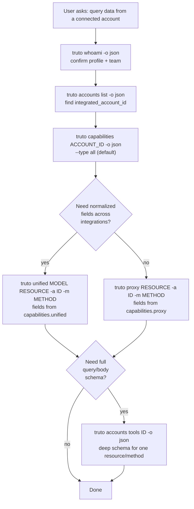

# Querying Data from Connected Accounts

This is the discovery-first reference for fetching data from a Truto-connected account. Read this **before** writing any `truto unified`, `truto proxy`, or `truto custom` command. The single most common LLM failure mode against Truto is guessing resource and method names — every step below exists to make that impossible.

## The discovery-first contract

Every data-plane command (`unified`, `proxy`, `custom`, `export`, `diff`, `batch`) accepts arguments — model, resource, method — that are **specific to the integration the account is connected to**. HubSpot exposes `contacts`/`companies`/`deals`; Bigcommerce exposes `products`/`orders`/`customers`; ServiceNow exposes `incident`/`change_request`/`problem`. There is no universal list. The capabilities endpoint is the source of truth, and you must consult it before constructing the call.



## `truto capabilities <target>` reference

```bash
truto capabilities <target> [options]
```

### Arguments

| Argument | Required | Description |
|----------|----------|-------------|
| `<target>` | Yes | Integration **slug** (e.g. `hubspot`) **or** integrated-account **UUID**. Auto-detected: anything matching the v4 UUID pattern is treated as an account; everything else as an integration slug. |

### Options

| Flag | Description | Default |
|------|-------------|---------|
| `-t, --type <type>` | Capability surface: `proxy` \| `unified` \| `all` | `all` |
| `--has-description` | Only return proxy methods that have a description | `true` (on by default) |
| `--no-has-description` | Include proxy methods even if they have no description (widens the result set) | — |
| `--methods <list>` | Comma-separated method filter (`list,get,create,update,delete` or any custom name) | — |
| `--resource <name>` | Filter to a single resource by name | — |
| `--target <kind>` | Force target kind when auto-detection is wrong: `integration` \| `account` | auto |

All [global flags](../SKILL.md#global-options) (`-p`, `-o`, `-v`, `--api-url`, `--token`) apply.

### HTTP equivalents

| CLI target | HTTP path |
|------------|-----------|
| Integration slug or UUID | `GET /integration/<slug-or-id>/capabilities` |
| Integrated-account UUID | `GET /integrated-account/<uuid>/capabilities` |

Query params on the HTTP endpoint mirror the CLI flags (`type`, `has_description`, `methods`, `resource`).

### Account vs integration target

- **Account target** (`truto capabilities <uuid>`) — the most actionable: returns exactly what THIS connected account can do, factoring in environment-level overrides (`env_overridden: true` on a unified row means a per-environment customization is in effect).
- **Integration target** (`truto capabilities hubspot`) — useful before connecting an account or for catalog browsing. Returns what the integration definition supports in general; doesn't include `account` or `env_overridden`.

## Reading the capabilities response

Real captured response, trimmed for readability (Bigcommerce account, `--resource products` filter):

```json
{
  "integration": {
    "id": "cef71931-64b9-4968-8465-08e370d69d71",
    "name": "bigcommerce",
    "label": "Bigcommerce",
    "category": "ecommerce"
  },
  "environment_id": "9874661d-8702-4005-881a-14aed15c67b5",
  "proxy": [
    {
      "resource": "products",
      "methods": [
        {
          "method": "list",
          "name": "list_all_bigcommerce_products",
          "description": "Returns a list of Products. You can filter by their names, price, brands, etc.",
          "has_description": true,
          "has_query_schema": true,
          "has_body_schema": false,
          "api_documentation_url": null
        },
        {
          "method": "get",
          "name": "get_single_bigcommerce_product_by_id",
          "description": "Get a single product by its ID.",
          "has_description": true,
          "has_query_schema": true,
          "has_body_schema": false,
          "api_documentation_url": null
        },
        {
          "method": "create",
          "name": "create_a_bigcommerce_product",
          "description": "Creates a Product. Only one product can be created at a time...",
          "has_description": true,
          "has_query_schema": false,
          "has_body_schema": true,
          "api_documentation_url": null
        },
        {
          "method": "update",
          "name": "update_a_bigcommerce_product_by_id",
          "description": "Updates a single Product by its ID.",
          "has_description": true,
          "has_query_schema": false,
          "has_body_schema": true,
          "api_documentation_url": null
        },
        {
          "method": "delete",
          "name": "delete_a_bigcommerce_product_by_id",
          "description": "Delete a Product by its ID.",
          "has_description": true,
          "has_query_schema": false,
          "has_body_schema": false,
          "api_documentation_url": null
        }
      ]
    }
  ],
  "unified": [
    {
      "model": "ecommerce",
      "model_label": "Unified E-Commerce API",
      "resource": "products",
      "description": "The product represent a product in E-Commerce.",
      "docs_url": "https://truto.one/docs/api-reference/unified-e-commerce-api/products",
      "methods": ["get", "list"],
      "env_overridden": false
    }
  ],
  "auth": {
    "formats": ["api_key"],
    "fields": [
      { "name": "store_hash", "label": "Store Hash", "type": "text",     "required": true },
      { "name": "api_key",    "label": "API Key",    "type": "password", "required": true }
    ],
    "documentation_link": "https://wiki.truto.one/integration-guides/bigcommerce/#finding-your-store-hash-and-api-key"
  },
  "ai_readiness": {
    "proxy_methods": 10,
    "proxy_methods_with_descriptions": 5,
    "ai_ready_score": 0.5
  },
  "account": {
    "id": "121aba7d-b4d4-4eb0-9654-2c784db5fc1f",
    "status": "active",
    "authentication_method": "api_key",
    "is_blocked": false
  }
}
```

### Field-to-CLI mapping

| Capabilities field | Use it as… |
|--------------------|------------|
| `proxy[].resource` | The `<resource>` positional in `truto proxy <resource>` |
| `proxy[].methods[].method` | The `-m <method>` value for `truto proxy` (`list` / `get` / `create` / `update` / `delete` / any custom name) |
| `proxy[].methods[].name` | A human label (e.g. `list_all_bigcommerce_products`) — informational only; you don't pass it to the CLI |
| `proxy[].methods[].description` | What the method actually does — read this before deciding whether it fits the user's intent |
| `proxy[].methods[].has_query_schema` | If `true`, `truto accounts tools <id>` returns a `query_schema` describing valid `-q` keys for this method |
| `proxy[].methods[].has_body_schema` | If `true`, the method takes a request body (`-b`/`--stdin`) — required for `create`/`update`/most custom methods |
| `unified[].model` + `unified[].resource` | The two positionals in `truto unified <model> <resource>` |
| `unified[].methods[]` | The `-m <method>` value for `truto unified` (typically `list`/`get`, sometimes `create`/`update`/`delete`/custom) |
| `unified[].docs_url` | Public docs page for the unified model resource — link to it when explaining results |
| `unified[].env_overridden` | `true` means this environment has customized the mapping (`env-unified-models` / `env-unified-model-mappings`) — behavior may differ from the base mapping |
| `auth.formats`, `auth.fields` | Credential shape the account already uses — never invent these fields |
| `account.status` | Must be `active`. `blocked`/`paused`/`expired` will fail at call time — fix the account first |
| `account.is_blocked` | Hard stop — `truto accounts refresh-credentials <id>` or reconnect via Link before retrying |
| `ai_readiness.ai_ready_score` | Fraction of proxy methods with descriptions. Low scores (e.g. `0.2`) mean LLM-driven calls will be guesswork — prefer the unified API for that integration |

## Copyable command templates

Substitute the `UPPERCASE_PLACEHOLDERS` with values pulled from the capabilities response.

### Unified API

```bash
ACCOUNT=<uuid>

truto unified MODEL RESOURCE                       -a $ACCOUNT -o json
truto unified MODEL RESOURCE                       -a $ACCOUNT -o json -q "limit=50"
truto unified MODEL RESOURCE                       -a $ACCOUNT -o json -q "next_cursor=CURSOR_FROM_STDERR"
truto unified MODEL RESOURCE RESOURCE_ID -m get    -a $ACCOUNT -o json
truto unified MODEL RESOURCE             -m create -a $ACCOUNT -o json -b '{"FIELD":"VALUE"}'
truto unified MODEL RESOURCE RESOURCE_ID -m update -a $ACCOUNT -o json -b '{"FIELD":"NEW_VALUE"}'
truto unified MODEL RESOURCE RESOURCE_ID -m delete -a $ACCOUNT -o json
truto unified MODEL RESOURCE             -m CUSTOM_METHOD -a $ACCOUNT -o json -b '{"key":"value"}'

# Body from stdin (useful when the body is computed)
echo '{"FIELD":"VALUE"}' | truto unified MODEL RESOURCE -m create -a $ACCOUNT --stdin -o json
```

### Proxy API

```bash
ACCOUNT=<uuid>

truto proxy RESOURCE                       -a $ACCOUNT -o json
truto proxy RESOURCE                       -a $ACCOUNT -o json -q "limit=100,page=2"
truto proxy RESOURCE RESOURCE_ID -m get    -a $ACCOUNT -o json
truto proxy RESOURCE             -m create -a $ACCOUNT -o json -b '{"FIELD":"VALUE"}'
truto proxy RESOURCE RESOURCE_ID -m update -a $ACCOUNT -o json -b '{"FIELD":"NEW_VALUE"}'
truto proxy RESOURCE RESOURCE_ID -m delete -a $ACCOUNT -o json
truto proxy RESOURCE             -m CUSTOM_METHOD -a $ACCOUNT -o json -b '{"key":"value"}'
```

A custom method name becomes a path segment: `-m search` → `POST /proxy/<resource>/search`.

### Custom API

When the resource isn't in `capabilities.proxy[]` but the integration exposes a raw HTTP path (often documented under the integration's docs):

```bash
ACCOUNT=<uuid>

truto custom /API_PATH                             -a $ACCOUNT -o json
truto custom /API_PATH -m POST -b '{"key":"value"}' -a $ACCOUNT -o json
truto custom /API_PATH -H "X-Custom-Header=value"  -a $ACCOUNT -o json
```

### Bulk export (auto-paginates)

```bash
truto export RESOURCE        -a $ACCOUNT -o ndjson --out data.ndjson    # proxy (no slash)
truto export MODEL/RESOURCE  -a $ACCOUNT -o ndjson --out data.ndjson    # unified (with slash)
```

## Going deeper: when capabilities isn't enough

Capabilities tells you that a method exists. It does NOT tell you which `-q` query params or `-b` body fields the method accepts. When you need that:

```bash
# Schema dump for one resource (one row per method)
truto accounts tools $ACCOUNT --methods list,get -o json

# Filter by tags too (some integrations tag methods like 'refund')
truto accounts tools $ACCOUNT --methods list --tags contacts,deals -o json
```

The response includes `query_schema` and `body_schema` — both are JSON Schema. Use them to:

1. Validate `-q` keys before calling.
2. Construct `-b` JSON that matches the integration's expected shape.
3. Surface required vs optional fields back to the user.

`accounts tools` is verbose (full schemas inline). Don't use it as your primary discovery tool — use `capabilities` first, then drill into `accounts tools` only for the specific resource/method you intend to call.

## Pagination

List calls return up to ~25 records by default. The CLI prints the next cursor to **stderr**:

```
Next page: -q next_cursor=eyJpZCI6IjEwMSJ9
```

To paginate, copy the cursor and re-run with `-q`:

```bash
truto unified crm contacts -a $ACCOUNT -o json -q "next_cursor=eyJpZCI6IjEwMSJ9"
```

For full extraction across all pages, use `truto export` instead — it auto-paginates and supports streaming `ndjson` / `csv` writes.

## Failure modes and how to recover

### Proxy 404 → "Did you mean…?"

When `truto proxy` 404s, the CLI silently re-runs capabilities for the account and adds one of these hints to the error:

- **Resource near-match found:** `Resource \`contac\` is not exposed on this account. Did you mean: contacts, companies?`
- **Method near-match found:** `Method \`fetch\` is not implemented for \`contacts\`. Did you mean: get, list?`
- **Method exact-not-implemented:** `Method \`search\` is not implemented for \`contacts\`. Available: list, get, create, update, delete.`
- **Unknown resource, no near-match:** `Resource \`foo\` is not exposed on this account. Run \`truto capabilities <id> --type proxy\` to list available resources.`
- **Capabilities also failed (network/auth):** `Run \`truto capabilities <id> --type proxy\` to list available resources.`

Read the hint and act on it. Don't silently fall back to a different command.

### `--type unified` returns `"proxy": []`

Expected — the `--type` flag filters the response. To see proxy resources, drop the flag (`--type all` is the default) or pass `--type proxy`.

### `--methods list` returns `No results found.` in table mode

Two possible causes:

1. **Default `--has-description` filter excluded everything.** Re-run with `--no-has-description` to include proxy methods that lack documentation (the integration may not have descriptions yet — visible in `ai_readiness.proxy_methods_with_descriptions`).
2. **Table renderer mismatch.** Some CLI versions render zero rows for capabilities even when JSON has data. Always use `-o json` for capabilities; trust the JSON shape over the table.

### Unified call works but returns weird-shaped data

Check `unified[].env_overridden` for that resource. If `true`, this environment has a custom mapping that may differ from the base. Inspect it with:

```bash
truto env-unified-models list -o json
truto env-unified-model-mappings list --env_unified_model_id <id> -o json
```

To iterate on a unified mapping locally without making real API calls, use [`truto unified test-mapping`](data-plane.md#iterate-on-a-mapping-locally-truto-unified-test-mapping).

### Account is blocked or expired

If `account.status` is anything other than `active`, or `account.is_blocked` is `true`:

```bash
truto accounts refresh-credentials $ACCOUNT
```

If that doesn't work, the user needs to reconnect through Truto Link.

## `jq` recipes against capabilities

```bash
ACCOUNT=<uuid>

# Just the proxy resource names
truto capabilities $ACCOUNT -o json | jq -r '.proxy[].resource'

# proxy resource → comma-separated list of methods
truto capabilities $ACCOUNT -o json | jq -r '.proxy[] | "\(.resource): \(.methods | map(.method) | join(","))"'

# Just the unified routes (model/resource pairs)
truto capabilities $ACCOUNT -o json | jq -r '.unified[] | "\(.model)/\(.resource)"'

# Only proxy methods that take a body (i.e. mutating)
truto capabilities $ACCOUNT -o json | jq -r '.proxy[] | .resource as $r | .methods[] | select(.has_body_schema) | "\($r) -m \(.method)"'

# Auth fields the account uses (label and required-ness)
truto capabilities $ACCOUNT -o json | jq -r '.auth.fields[] | "\(.name)\t\(.label)\trequired=\(.required)"'

# Quick AI-readiness sanity check
truto capabilities $ACCOUNT -o json | jq '.ai_readiness'
```

These are designed to be the first commands an LLM agent runs after `accounts list` — they collapse the full capabilities payload to just the strings you need to construct the next command.

## End-to-end worked examples

### Bigcommerce account — list products via unified API

```bash
ACCOUNT=121aba7d-b4d4-4eb0-9654-2c784db5fc1f

# Discover
truto capabilities $ACCOUNT -o json | jq '.unified[] | select(.resource == "products")'
# → { model: "ecommerce", resource: "products", methods: ["get","list"], ... }

# Call with arguments copied straight out
truto unified ecommerce products -a $ACCOUNT -o json
truto unified ecommerce products PRODUCT_ID -m get -a $ACCOUNT -o json
```

### HubSpot account — list contacts via proxy API

```bash
ACCOUNT=757a9621-9416-4537-92a0-5032db55dc27

# Discover proxy resources only
truto capabilities $ACCOUNT --type proxy -o json | jq -r '.proxy[].resource'
# contacts
# companies
# deals
# ...

# Call
truto proxy contacts -a $ACCOUNT -o json
truto proxy contacts CONTACT_ID -m get -a $ACCOUNT -o json
truto proxy contacts -m create -a $ACCOUNT -b '{"properties":{"firstname":"Jane","email":"jane@example.com"}}' -o json
```

### "What does this integration support before I connect anything?"

```bash
truto capabilities salesforce -o json | jq '{ unified: [.unified[].resource], proxy: [.proxy[].resource] }'
```
